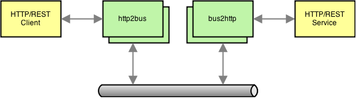

# msb-proxies 

HTTP adapters for [microservicebus](http://github.com/tcdl/msb) framework



## Installation

To use globally from the command line:

```
$ npm install msb-proxies -g
```

## http2bus

```
$ http2bus -p=8080 examples/http2bus.json
```

Arguments:
- **-port** or **-p** Default: 0 (random)
- **-dump** or **-d** Default: false – print the config
- **...** Load the config from a JSON or JS file at this path

### Configuration

Example:

```json
{
  "channelMonitorEnabled": false,
  "port": 8080,
  "routes": [
    {
      "bus": {
        "namespace": "test:through",
        "responseTimeout": 3000,
        "waitForResponses": 1
      },
      "http": {
        "methods": ["get"],
        "path": "/api/item/:id"
      }
    }
  ]
}
```

## bus2http

```
$ bus2http examples/http2bus.json
```

Arguments:
- **-dump** or **-d** Default: false – print the config
- **...** Load the config from a JSON or JS file at this path

### Configuration

Example:

```json
{
  "channelMonitorEnabled": false,
  "routes": [
    {
      "bus": {
        "namespace": "test:through"
      },
      "http": {
        "baseUrl": "https://www.google.com"
      }
    }
  ]
}
```

## Docker Container

### Building

```
$ docker build -t msb-proxies .
```

### Running

#### Tests

With a local Redis container. (See https://github.com/dockerfile/redis)

```
$ docker run --rm --link redis:redis msb-proxies npm test
```

#### http2bus

With a local Redis container and with configuration on host.

(Assuming files exist on the host at `/etc/msb-proxies/msb.json` and `/etc/msb-proxies/http2bus.json`.)

```
$ docker run --name http2bus -d -p 8080:8080 --link redis:redis -v /etc/msb-proxies:/opt/msb-proxies/config msb-proxies bin/http2bus config/http2bus.json
```

#### bus2http

With a local Redis container and configuration on host.

(Assuming files exist on the host at `/etc/msb-proxies/msb.json` and `/etc/msb-proxies/bus2http.json`.)

```
$ docker run --name bus2http -d --link redis:redis -v /etc/msb-proxies:/opt/msb-proxies/config msb-proxies bin/bus2http config/bus2http.json
```
